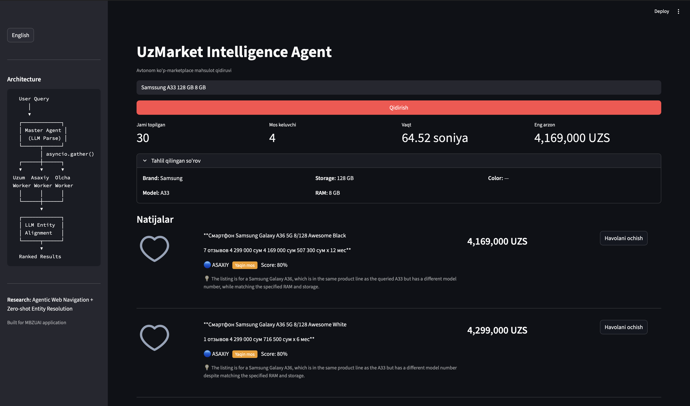

# Heterogeneous E-commerce Data Integration via Autonomous Agents

> **A research-oriented system for agentic reasoning in cross-platform e-commerce data fusion**

[]()
[]()
[]()
[]()
[]()

---

## Abstract

E-commerce markets in Central Asia operate as **heterogeneous data silos**: each platform uses distinct naming conventions (multilingual Uzbek/Russian/English), proprietary categorization schemas, and incompatible frontend architectures (React, Nuxt.js, SSR+JS). Consumers comparing prices for a specific product must manually search multiple platforms and cognitively filter accessories, similar models, and unrelated items from results.

This work presents a **multi-agent system** that autonomously navigates JavaScript-heavy marketplace frontends, extracts unstructured product data, and applies LLM-driven entity resolution to classify listings against a structured user query. The system achieves **zero-shot entity alignment** without training data, handles **multilingual product titles** (Uzbek, Russian, English), and provides **transparent reasoning chains** for each classification decision.

---

## System in Action (Reasoning Demo)

The agent performs multi-step reasoning to filter out noise (accessories) and align products across heterogeneous platforms.



> **Case Study:** Search for "Samsung A33 128 GB 8 GB".
> **Intelligence:** The system autonomously identified that exact matches were scarce and, rather than returning irrelevant accessories, it suggested the **Samsung Galaxy A36** as a **"Near Match" (80% confidence)** based on its logic-driven specification alignment.

---

## 1. Research Contributions

### 1.1 Agentic Web Navigation

The system employs a **Master-Worker agent architecture** where three autonomous Worker agents operate Chromium browser instances in parallel via `asyncio.gather()`. Each worker navigates a different JavaScript SPA, waits for client-side rendering to complete, and extracts product data through DOM evaluation.

### 1.2 Cross-Platform Data Fusion

Raw product listings from three architecturally distinct platforms (React, Nuxt.js, SSR) are normalized into a unified Pydantic schema and fused into a single ranked result set. The fusion process handles:

- **Price normalization** across UZS formats (`2 499 000 сўм`, `2499000`, installment strings)
- **Deduplication** via deterministic SHA-256 listing IDs
- **Multi-source ranking** combining confidence, relevance score, and price

### 1.3 Zero-Shot Entity Resolution via LLM

Each scraped listing is classified into one of four categories (`EXACT`, `CLOSE`, `ACCESSORY`, `UNRELATED`) using **Grok-3-mini** in structured JSON mode. No training data or fine-tuning is required. The LLM performs chain-of-thought reasoning over:

- Brand and model matching
- Specification verification (storage, RAM, color)
- Accessory detection (cases, cables, screen protectors)

A **deterministic heuristic fallback** ensures the system operates without an API key, using keyword overlap and accessory keyword lists across Uzbek, Russian, and English.

### 1.4 Connection to Active Research Areas

| Research Area | Relevance |
|---|---|
| **Autonomous Agents** | Master-Worker coordination for real-world web tasks (cf. WebArena, Mind2Web, AgentBench) |
| **Information Extraction** | Zero-shot entity alignment across heterogeneous sources without supervision |
| **Multilingual NLP** | Cross-lingual understanding of mixed Uzbek/Russian/English product titles |
| **Explainable AI** | Transparent reasoning chains displayed to end users for every classification |

---

## 2. System Architecture

```
                          ┌──────────────────────┐
                          │     User Query        │
                          │ "Samsung A33 128GB"   │
                          └──────────┬───────────┘
                                     │
                          ┌──────────▼───────────┐
                          │    Master Agent       │
                          │  ┌────────────────┐   │
                          │  │ LLM Query Parse│   │
                          │  │ (Grok-3-mini)  │   │
                          │  └───────┬────────┘   │
                          │          │             │
                          │   asyncio.gather()     │
                          │  ┌───────┼───────┐     │
                          │  ▼       ▼       ▼     │
                          │ Uzum  Asaxiy  Olcha    │
                          │ Worker Worker Worker   │
                          │ (React)(SSR)  (Nuxt)   │
                          │  │       │       │     │
                          │  └───────┼───────┘     │
                          │          ▼             │
                          │  ┌────────────────┐   │
                          │  │ LLM Entity     │   │
                          │  │ Alignment      │   │
                          │  │ (per listing)  │   │
                          │  └───────┬────────┘   │
                          │          ▼             │
                          │  ┌────────────────┐   │
                          │  │ Rank & Filter  │   │
                          │  └───────┬────────┘   │
                          └──────────┼───────────┘
                                     ▼
                          ┌──────────────────────┐
                          │  Streamlit UI / CLI   │
                          │  Ranked results with  │
                          │  reasoning + links    │
                          └──────────────────────┘
```

---

## 3. Project Structure

```
├── agents/
│   ├── master.py            # Orchestrator: parse → scrape → align → rank
│   └── worker.py            # Per-marketplace autonomous worker
├── tools/
│   ├── base.py              # ABC-enforced Playwright scraper interface
│   ├── uzum.py              # Uzum.uz scraper (React SPA)
│   ├── asaxiy.py            # Asaxiy.uz scraper (SSR + JS)
│   └── olcha.py             # Olcha.uz scraper (Nuxt.js / Vue)
├── core/
│   ├── models.py            # Pydantic v2 data models (strict typing)
│   ├── config.py            # Centralized env-based configuration
│   ├── reasoning.py         # Grok-3-mini reasoning + heuristic fallback
│   └── exceptions.py        # Custom AppException hierarchy
├── ui/
│   └── app.py               # Streamlit bilingual interface (UZ / EN)
├── tests/
│   ├── test_models.py       # 8 tests — data model validation
│   └── test_reasoning.py    # 11 tests — heuristic + exception hierarchy
├── docs/
│   └── screenshots/
│       └── main_demo.png    # System demo screenshot
├── main.py                  # CLI + UI entry point
├── requirements.txt         # Pinned dependencies
├── pyproject.toml           # Project metadata + pytest config
├── .env.example             # Configuration template
└── README.md                # This document
```

---

## 4. Installation

### Prerequisites

- **macOS / Linux** (tested on Apple Silicon M4)
- **Python 3.10+**
- **xAI API key** (optional — heuristic mode works without it)

### Manual Setup

```bash
cd "Heterogeneous E-commerce Data Integration via Autonomous Agents"

python3 -m venv .venv
source .venv/bin/activate

pip install -r requirements.txt

python -m playwright install chromium

cp .env.example .env
# Edit .env and set your XAI_API_KEY (optional)
```

### Verify Installation

```bash
python -m pytest tests/ -v
```

Expected: **19 tests passing**.

---

## 5. Usage

### CLI Mode

```bash
python main.py "Samsung Galaxy A33 5G 128GB"
```

Output: structured log with ranked listings, confidence tags, prices, and direct links.

### Web Interface

```bash
python main.py --ui
```

Opens a Streamlit dashboard at `http://localhost:8501` with bilingual (Uzbek/English) interface.

---

## 6. Configuration

All settings are managed via `.env`:

| Variable | Default | Description |
|---|---|---|
| `XAI_API_KEY` | *(empty)* | xAI API key for Grok-3-mini |
| `XAI_BASE_URL` | `https://api.x.ai/v1` | xAI API endpoint |
| `LLM_MODEL` | `grok-3-mini` | Model identifier |
| `LLM_TEMPERATURE` | `0.1` | LLM temperature (low = deterministic) |
| `SCRAPE_TIMEOUT_MS` | `30000` | Page load timeout per marketplace |
| `MAX_RESULTS_PER_SITE` | `15` | Max listings extracted per site |
| `HEADLESS` | `true` | Run browsers headlessly |
| `LLM_CONCURRENCY_LIMIT` | `10` | Max concurrent LLM API calls |

---

## 7. Engineering Standards

| Standard | Implementation |
|---|---|
| **Type Hints** | Full PEP 484 annotation on every function, variable, and return type |
| **Abstract Base Classes** | `BaseScraper(abc.ABC)` with `__init_subclass__` enforcement |
| **Custom Exceptions** | 3-tier hierarchy: `ScraperException`, `ReasoningException`, `PipelineException` |
| **No `print()` statements** | All output via `logging` module with structured format |
| **Pinned dependencies** | Exact versions in `requirements.txt` for reproducibility |
| **Pydantic v2** | Strict model validation with `computed_field` and `Field(...)` descriptors |
| **Timezone-aware datetimes** | `datetime.now(timezone.utc)` — no deprecated `utcnow()` |

---

## 8. Error Handling Architecture

```
AppException
├── ScraperException
│   ├── NavigationError          # Page load / timeout / DNS failures
│   ├── ExtractionError          # DOM parsing / CSS selector failures
│   └── MarketplaceUnavailable   # HTTP 5xx / connection refused
├── ReasoningException
│   ├── LLMConnectionError       # API unreachable / auth failure
│   ├── LLMResponseError         # Malformed JSON / unexpected schema
│   └── QueryParseError          # Cannot extract structured query
└── PipelineException
    ├── WorkerError              # Individual worker failure
    └── OrchestratorError        # Master-level coordination failure
```

Every exception carries `message`, `detail`, and `context` fields for structured debugging.

---

## 9. Technology Stack

| Component | Technology | Rationale |
|---|---|---|
| Language | Python 3.10+ | Async ecosystem, type hints, research ecosystem |
| Browser Automation | Playwright 1.58 | Async API, Chromium on ARM, reliable SPA handling |
| LLM | xAI Grok-3-mini | Cost-effective reasoning, OpenAI-compatible SDK |
| Data Validation | Pydantic v2 | Runtime type enforcement across pipeline |
| Web Interface | Streamlit 1.54 | Rapid prototyping of research demos |
| Configuration | python-dotenv | Environment-based configuration |

---

## 10. Limitations and Future Work

- **Anti-bot resilience**: Production deployment requires proxy rotation and browser fingerprint randomization.
- **Caching layer**: Currently re-scrapes on every query; a TTL-based cache (Redis/SQLite) would reduce latency.
- **Local LLM support**: Integration with Ollama or vLLM for fully offline operation.
- **Marketplace expansion**: Mediapark.uz, Texnomart.uz, and cross-border platforms.
- **Temporal analysis**: Storing results over time for price trend detection and arbitrage alerting.
- **Evaluation benchmark**: Constructing a labeled dataset of Uzbek e-commerce listings for quantitative entity resolution evaluation.

---

## License

MIT License

---

Developed with ❤️ by [uzbtrust](https://github.com/uzbtrust)
